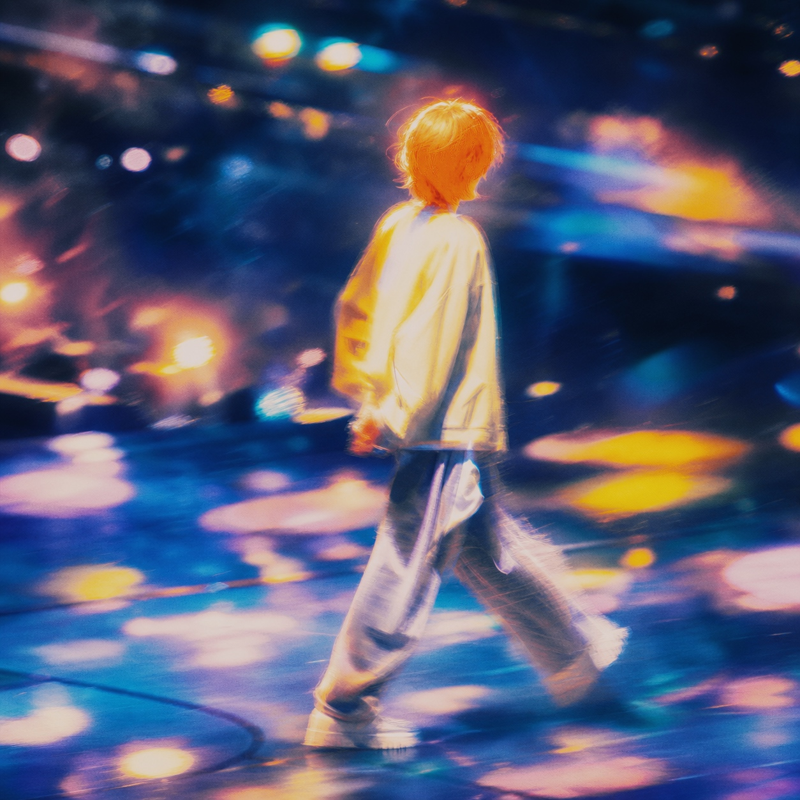

## About Me

I am a graduate student of M.Eng. Computer Science at Xiamen University, and a photography enthusiast. Against an era increasingly awash with AI-generated fabrications, I try to capture and preserve the precious, fleeting moments tucked away in the quiet routines of life.

## Research Interest

Lorem ipsum dolor sit amet, consectetur adipiscing elit. Aliquam finibus ipsum ac erat aliquam dapibus. Vestibulum vehicula placerat ex, a consectetur odio pharetra quis. Mauris id urna ante. Fusce pharetra diam ac nisi aliquet, vel egestas ex iaculis. Pellentesque laoreet cursus tellus sed pellentesque. Praesent a rhoncus elit. Nunc ipsum nisl, consequat sit amet pretium quis, gravida id ipsum.

## Education Background

Period | Institute | Major
-------|-----------|-------
2026.09-2029.06 | Xiamen University | Computer Science and Technology
2022.09-2026.06 | Xiamen University | Artificial Intelligence

## Typography

This is a [link](http://google.com). Something *italics* and something **bold**.

Here is a table

## Awards

Year | Award | Detail
-----|-------|--------
2026 | Outstanding Graduate | The top 10% of graduates
2026 | First-class Academic Scholarship | Academically Ranking 9/106
2025 | National Encouragement Scholarship | Academically Ranking 7/105 with GPA 3.866/4.0
2025 | Chinese College Computer Competition | National First Prize (top 2% in national finals)
2025 | National Software Innovation Competition | Second Prize of East China Division
2025 | 4th Xiamen University AI Challenge, Ascend Cup | Championship
2024 | National Encouragement Scholarship | Academically Ranking 9/107 with GPA 3.777/4.0

---
> *Not every turn of life is answered right,*
> 
> *Nor every grief can be brought to light.*
> 
> *Yet still we rise from ruins out of sight,*
> 
> *And learn to find the lamps inside the night.*
